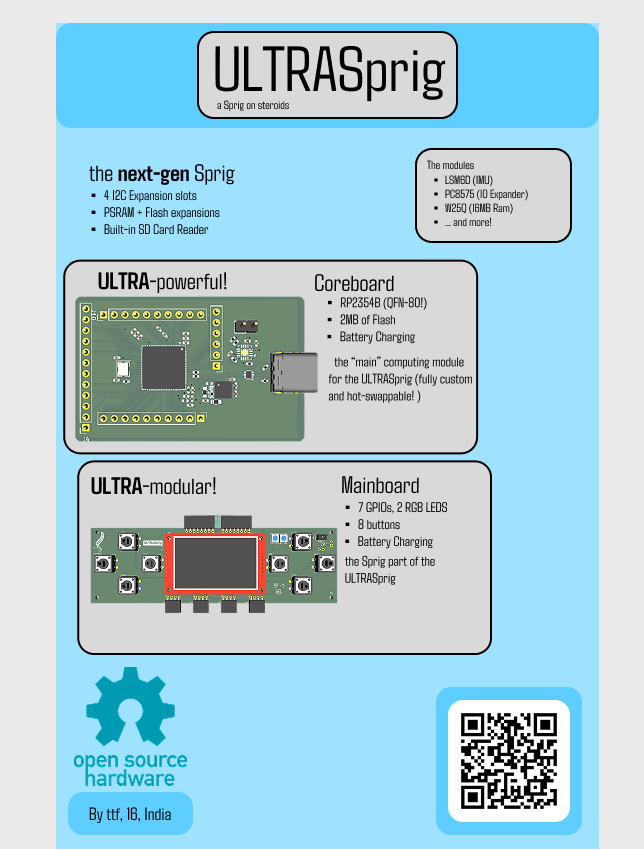
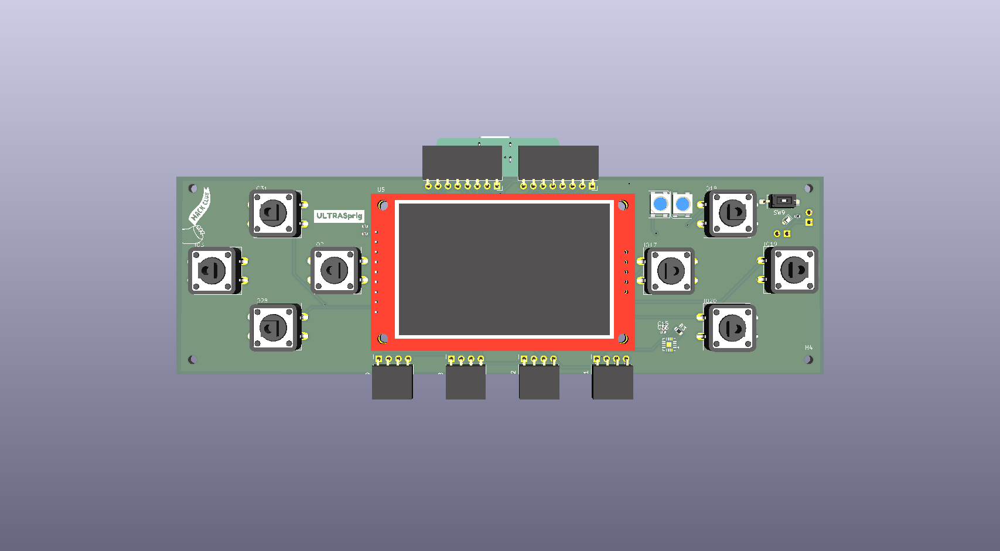
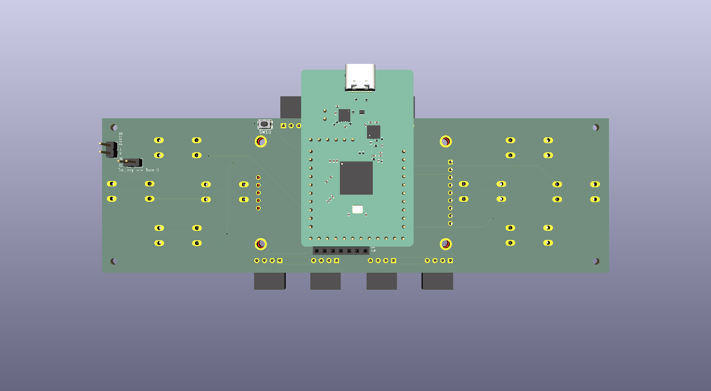
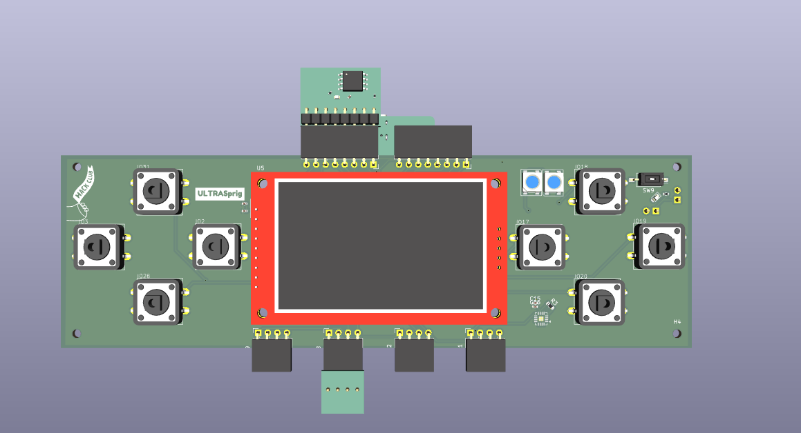
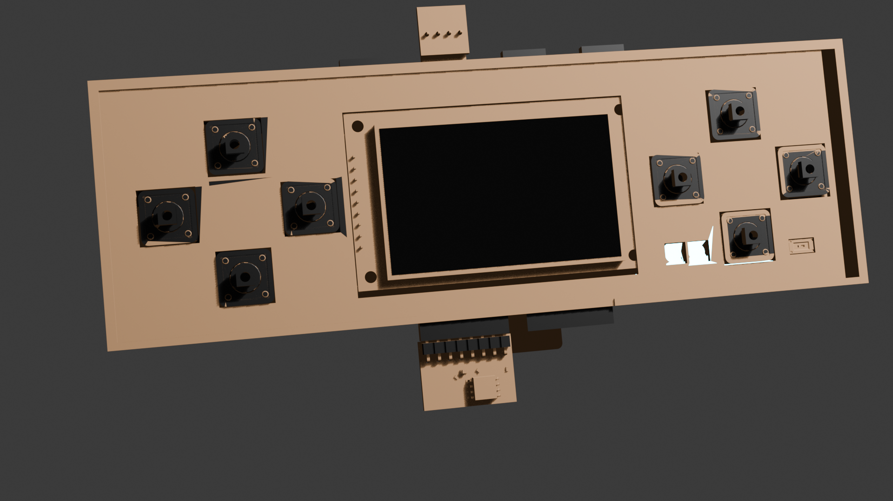
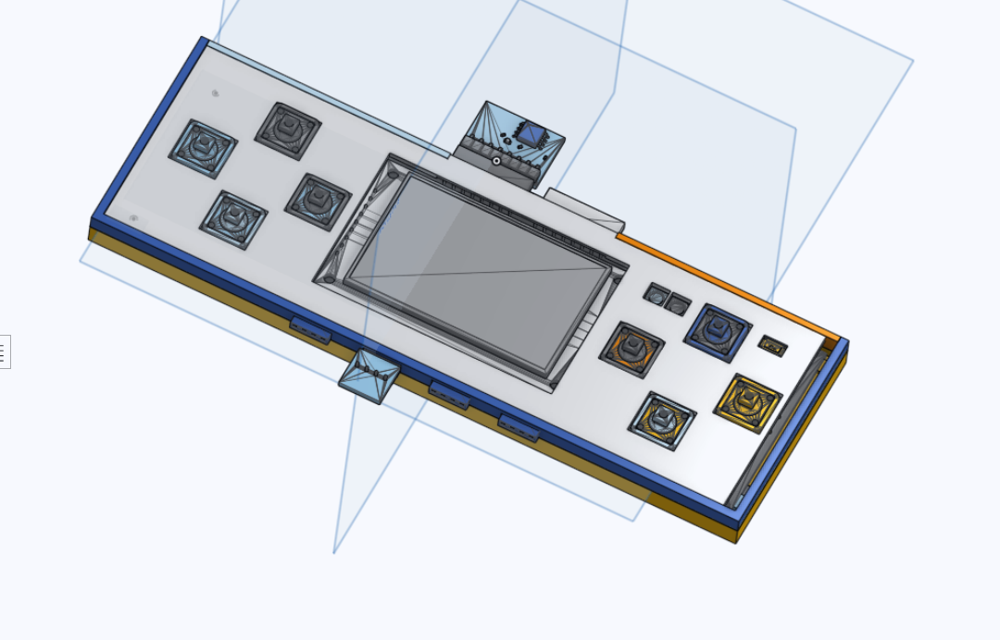
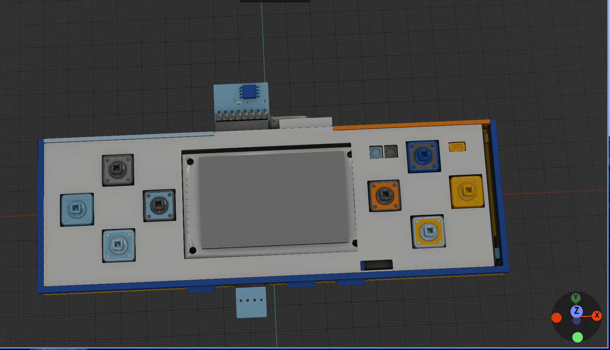
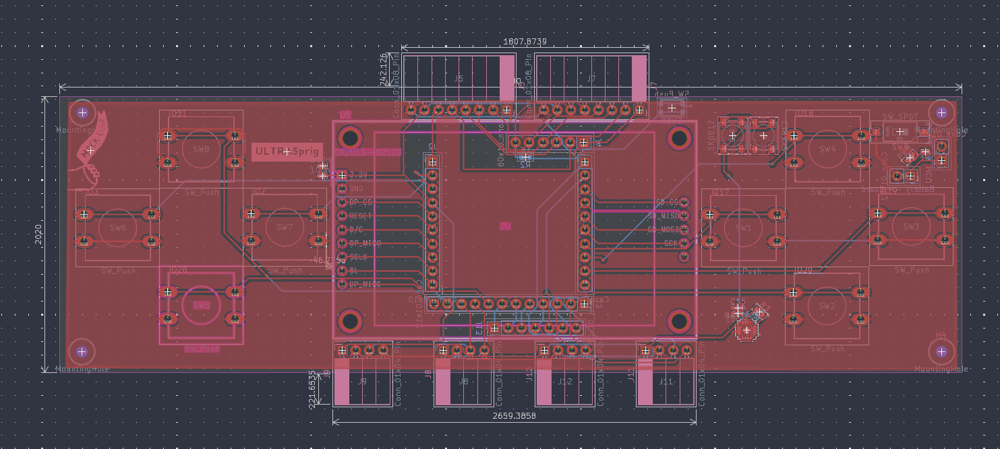
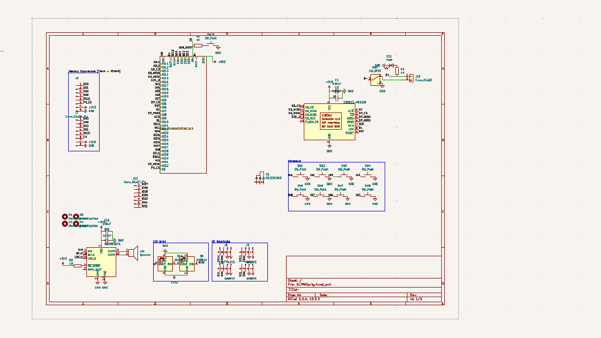
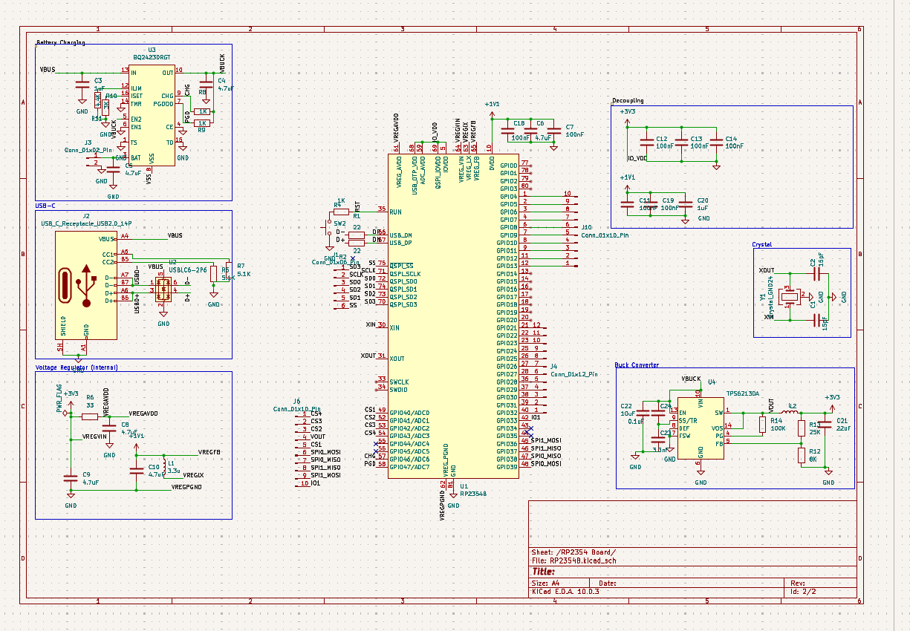

# the ULTRASprig

an updated version of the [Sprig](https://github.com/hackclub/sprig/), made to be ultra-modular and expansible!

# Why?
the current model of the sprig is a bit... outdated. It still runs on the RP2040, has only 4 (broken out) gpios and just 2Mb of flash. The ULTRASprig has 7 usable GPIOs, and a completely new expansion system that allows for up to 16MB of additional flash, + PSRAM. it also uses I2C "modules" to give even more  interfaces

## Notes:
- KiCad will throw a DRC error for the placement of the mounting headers (courtyard overlap with display), but this can be ignored safely 

# Setup
## RP2354B
- get the larger packages (the BQ, RP2354, and the TP) pre-assembled
- use a stencil to solder the smaller passives
- solder male headers into the broken out pins
## Mainboard
- Solder all components except the pinsockets
- while soldering the pinsockets, make sure to have 1mm of clearance between the tips and the SPI display
- insert the SD Card into the SPI Display
- for the battery headers, one battery header will be connected to the + and - of the battery, and the other should be connected to the battery pins of the coreboard
## Case
- the case must be printed in two parts, the front and the back
- there are 4 mounting holes in the case, which must be connected using screws to those mounting holes on the mainboard
- after that, place the backplate, ensuring that the battery pins line up with the battery hoels
# Usage
- build the firmware and flash it on the sprig

# Sub(Links)
- [Zine](Sprig_Zine.pdf)
- Mainboard
    - [Mainboard BoM](BOM.csv)
    - [Gerbers - Mainboard](gerbers.zip)
    - [Mainboard Design](Mainboard/)
- Core Board
    - [Core BoM](core_board/RP2354B/BOM.csv)
    - [Coreboard Design Files](core_board/RP2354B/)
- Expansions
    - IO Expander   
        - [Design](Expansions/IOExpander/)
        - [Gerbers](Expansions/IOExpander/Gerbers.zip)
        - [BoM](Expansions/IOExpander/BOM.csv)
    - Flash Breakout   
        - [Design](Expansions/FlashBreakout/)
        - [Gerbers](Expansions/FlashBreakout/gerbers.zip)
        - [BoM](Expansions/FlashBreakout/BOM.csv)
    - IMU Breakout   
        - [Design](Expansions/IMUBreakout/)
        - [Gerbers](Expansions/IMUBreakout/Gerbers.zip)
        - [BoM](Expansions/IMUBreakout/BOM.csv)

- [Gerbers - coreboard](core_board/RP2354B/Gerbers.zip)

# Zine

> check the pdf version too!
# Renders

> front view

> back view w/ board and battery headers

> front view, main board with modules

> a very rushed blender render rhyme

> case for the ULTRASprig

> textured preview of CAD
# Routing

> routed mainboard

> routed coreboard

# Schematics

> mainboard schematic

> coreboard schematic

> note: some of the cad model pictures are outdated, double-check the source file